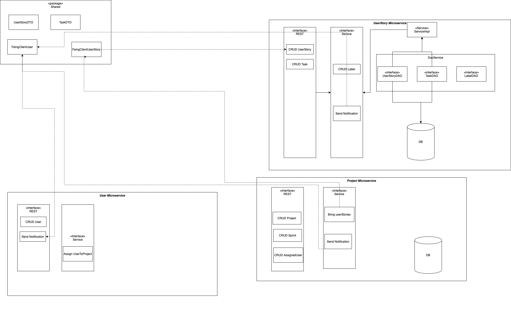

# ScrumBoardSystem

## Description
This project applies the spring framework with a microservices approach to generate a platform for SCRUM project management

### Entity Relationships Diagram

### Communication Design Diagram
The following Diagram shows how the communication between components its orchested:

 

